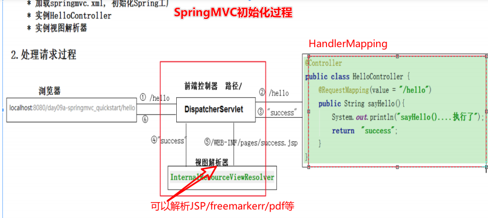
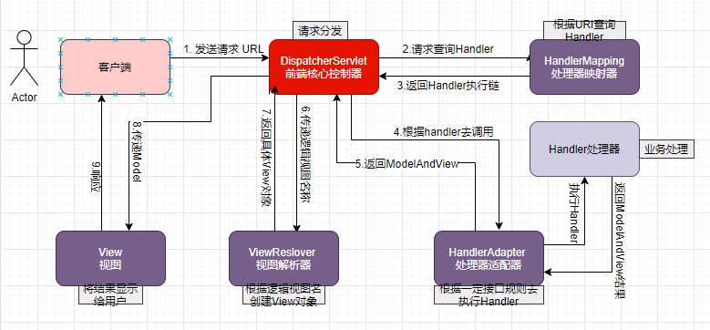

# SpringMVC总结
## 基础概念

### 什么是SpringMVC

> springmvc是spring的一个模块，基于mvc模式设计的框架，用于控制前端的请求分发。
>
> 优势：
>
> 1. 无需中间件即可与Spring整合
> 2. 基于组件技术易于拓展
> 3. 可以使用多种视图技术（如JSP、FreeMarker、thymeleaf 等）并支持各种请求资源的映射策略 
>    [java视图技术对比](https://chunsoft.blog.csdn.net/article/details/76407612?utm_medium=distribute.pc_relevant.none-task-blog-BlogCommendFromMachineLearnPai2-2.channel_param&depth_1-utm_source=distribute.pc_relevant.none-task-blog-BlogCommendFromMachineLearnPai2-2.channel_param)    (jsp、freemarker、velocity、thymeleaf对比)  

### SpringMVC的执行流程

>SpringMVC初始化过程
>
>
>
>1. 客户端发送请求到 DispatcherServlet 
>2. DispatcherServlet 查询 handlerMapping 找到处理请求的 Controller 
>3. Controller 调用业务逻辑后，返回 ModelAndView 
>4. DispatcherServlet 查询 ModelAndView，找到指定视图 
>5. 视图将结果返回到客户端

### SpringMVC的工作原理

>1. 用户发送请求至前端控制器 DispatcherServlet。
>2. DispatcherServlet 收到请求调用 HandlerMapping 处理器映射器。
>3. 处理器映射器找到具体的处理器(可以根据 xml 配置、注解进行查找)，生成处理器对象 及处理器拦截器(如果有则生成)一并返回给 DispatcherServlet。
>4. DispatcherServlet 调用 HandlerAdapter 处理器适配器。
>5. HandlerAdapter 经过适配调用具体的处理器(Controller，也叫后端控制器)。
>6. Controller 执行完成返回 ModelAndView。
>7. HandlerAdapter 将controller 执行结果 ModelAndView 返回给 DispatcherServlet。 
>8. DispatcherServlet 将 ModelAndView 传给 ViewReslover 视图解析器。
>9. ViewReslover 解析后返回具体 View。
>10. DispatcherServlet 根据 View 进行渲染视图（即将模型数据填充至视图中）。
>11. DispatcherServlet 响应用户。

### SpringMVC常用注解

>1. @Controller，使用它标记的类就是一个SpringMVC Controller 对象 
>2. @RequestMapping，处理请求映射地址
>3. @PathVariable，用于对应restful风格url中的参数
>   - @RequestMapping(value="/happy/{dayid}") 
>   - findPet(@PathVariable Stringdayid) 
>4. @RequestParam，请求的参数绑定到方法中的参数上 
>   - @RequestParam(value = "name", required = false) String name 
>5. @ResponseBody，将返回类型直接输入到http response body中
>6. @RequestBody，方法参数直接被绑定到http request body中

## 应用场景

## 面试常问

1. SpringMvc 的控制器是不是单例模式,如果是,有什么问题,怎么解决？

> 

2. SpringMvc 中函数的返回值是什么？

> 方法的返回值类型是ModelAndView时，需要在方法中创建 ModelAndView对象 
>
> 方法的返回值时String时，可以直接返回逻辑视图 
>
> 可以返回ModelAndView或者Json数据 
>
> 如果返回类型是void，需要跳转页面可以使用servlet方式请求 转发或重定向。

3. 简单介绍下 springMVC 和 struts2 的区别有哪些?

> 

4. @RequestMapping 注解用在类上面有什么作用？
5. 怎么样把某个请求映射到特定的方法上面？
6. 如果在拦截请求中,我想拦截 get 方式提交的方法,怎么配置？
7. SpringMvc 里面拦截器是怎么写的？
8. 怎么样在方法里面得到 Request,或者 Session？
9. 怎么样把 ModelMap 里面的数据放入 Session 里面？
10. 我想在拦截的方法里面得到从前台传入的参数,怎么得到？
11. 如果前台有很多个参数传入,并且这些参数都是一个对象的,那么怎么样快速得到这个对 象？
12. SpringMvc 中有个类把视图和数据都合并的一起的,叫什么？
13. SpringMVC 怎么样设定重定向和转发的？
14. SpringMvc 用什么对象从后台向前台传递数据的？
15. SpringMvc 怎么和 AJAX 相互调用的？
16. 当一个方法向 AJAX 返回特殊对象,譬如 Object,List 等,需要做什么处理？

