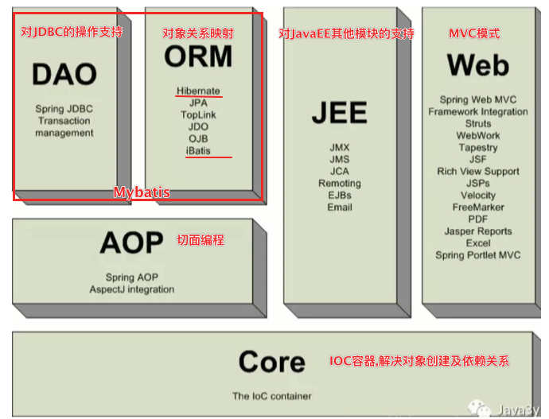
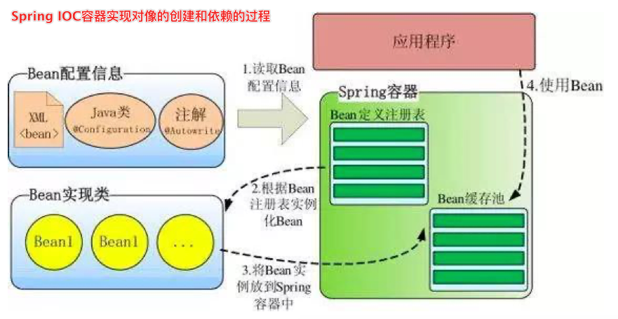
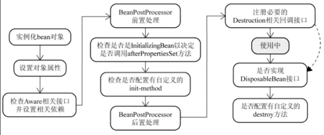

---

typora-root-url: ./img
---

# SpringMVC总结
## 基础概念

### 什么是SpringMVC

> springmvc是spring的一个模块，基于mvc模式设计的框架，用于控制前端的请求分发。
>
> 优势：
>
> 1. 无需中间件即可与Spring整合
> 2. 基于组件技术易于拓展
> 3. 可以使用多种视图技术（如JSP、FreeMarker、thymeleaf 等）并支持各种请求资源的映射策略 
>    [java视图技术对比](https://chunsoft.blog.csdn.net/article/details/76407612?utm_medium=distribute.pc_relevant.none-task-blog-BlogCommendFromMachineLearnPai2-2.channel_param&depth_1-utm_source=distribute.pc_relevant.none-task-blog-BlogCommendFromMachineLearnPai2-2.channel_param)    (jsp、freemarker、velocity、thymeleaf对比)  

### SpringMVC的执行流程

>SpringMVC初始化过程
>
>
>
>1. 客户端发送请求到 DispatcherServlet 
>2. DispatcherServlet 查询 handlerMapping 找到处理请求的 Controller 
>3. Controller 调用业务逻辑后，返回 ModelAndView 
>4. DispatcherServlet 查询 ModelAndView，找到指定视图 
>5. 视图将结果返回到客户端

### SpringMVC的工作原理


>1. 用户发送请求至前端控制器 DispatcherServlet。
>2. DispatcherServlet 收到请求调用 HandlerMapping 处理器映射器。
>3. 处理器映射器找到具体的处理器(可以根据 xml 配置、注解进行查找)，生成处理器对象 及处理器拦截器(如果有则生成)一并返回给 DispatcherServlet。
>4. DispatcherServlet 调用 HandlerAdapter 处理器适配器。
>5. HandlerAdapter 经过适配调用具体的处理器(Controller，也叫后端控制器)。
>6. Controller 执行完成返回 ModelAndView。
>7. HandlerAdapter 将controller 执行结果 ModelAndView 返回给 DispatcherServlet。 
>8. DispatcherServlet 将 ModelAndView 传给 ViewReslover 视图解析器。
>9. ViewReslover 解析后返回具体 View。
>10. DispatcherServlet 根据 View 进行渲染视图（即将模型数据填充至视图中）。
>11. DispatcherServlet 响应用户。

### SpringMVC常用注解

>1. @Controller，使用它标记的类就是一个SpringMVC Controller 对象 
>2. @RequestMapping，处理请求映射地址
>3. @PathVariable，用于对应restful风格url中的参数
>   - @RequestMapping(value="/happy/{dayid}") 
>   - findPet(@PathVariable Stringdayid) 
>
>4. @RequestParam，请求的参数绑定到方法中的参数上 
>  - @RequestParam(value = "name", required = false) String name 
>5. @ResponseBody，将返回类型直接输入到http response body中
>6. @RequestBody，方法参数直接被绑定到http request body中

## 参考资料

- [**SpringMVC入门就这么简单**](https://mp.weixin.qq.com/s?__biz=MzI4Njg5MDA5NA==&mid=2247483973&idx=1&sn=dda2252f37e5eb6db90db636a65c40bf&chksm=ebd74344dca0ca52d671fc0fa072bcc80892bfb5801ceaab6a4754036d246f5bef960c1840bd&scene=21#wechat_redirect)
- [浅析DDD(领域驱动设计)](https://www.jianshu.com/p/b6ec06d6b594)

## 面试常问

1. **SpringMvc 的控制器是不是单例模式,如果是,有什么问题,怎么解决？**

   > 

2. **SpringMvc 中函数的返回值是什么？**

   > 方法的返回值类型是ModelAndView时，需要在方法中创建 ModelAndView对象 
   >
   > 方法的返回值时String时，可以直接返回逻辑视图 
   >
   > 可以返回ModelAndView或者Json数据 
   >
   > 如果返回类型是void，需要跳转页面可以使用servlet方式请求 转发或重定向。

3. **简单介绍下 springMVC 和 struts2 的区别有哪些?**

   > 

4. **@RequestMapping 注解用在类上面有什么作用？**

   > 

5. **怎么样把某个请求映射到特定的方法上面？**
6. **如果在拦截请求中,我想拦截 get 方式提交的方法,怎么配置？**
7. **SpringMvc 里面拦截器是怎么写的？**
8. **怎么样在方法里面得到 Request,或者 Session？**
9. **怎么样把 ModelMap 里面的数据放入 Session 里面？**
10. **我想在拦截的方法里面得到从前台传入的参数,怎么得到？**
11. **如果前台有很多个参数传入,并且这些参数都是一个对象的,那么怎么样快速得到这个对 象？**
12. **SpringMvc 中有个类把视图和数据都合并的一起的,叫什么？**
13. **SpringMVC 怎么样设定重定向和转发的？**
14. **SpringMvc 用什么对象从后台向前台传递数据的？**
15. **SpringMvc 怎么和 AJAX 相互调用的？**
16. **当一个方法向 AJAX 返回特殊对象,譬如 Object,List 等,需要做什么处理？**

# Spring总结


## 基础概念

### Spring框架简介

**概述:**

​		Spring是轻量级开源框架,主要用于分层的服务端全栈开发.以IOC(控制反转)和AOP(面向切面)为内核.

**两大内核的主要目的:** 		

​		控制反转: 主要用于代码解耦;   面向切面: 主要用于功能增强 

**提供的功能:**   	
		表示层:SpringMVC;    业务层: 事务管理等;     持久层: Spring  JDBCTemplate， Spring Data

**开发特点:** 

- 基于POJO轻量级和最⼩侵⼊式开发 
- 通过依赖注⼊和⾯向接⼝实现松耦合 
- 基于切⾯和惯例进⾏声明式编程 
- 通过切⾯和模板减少代码的冗余

### IOC和DI


### AOP


### Spring IOC开发常用的注解及对应的XML配置标签

* 声明bean的注解：

  * `@Component`：用在类上，相当于`bean`标签(是下面👇三者的统一)

    ` value`属性：bean的唯一标识。如果不配置，默认以首字母小写的类名为id

  * `@Controller,  @Service,  @Repository`：分别用于web层、service层、dao层

* 配置bean的注解：

  * `@Scope`：配置作用范围 ,相当于bean标签的`scope`属性
    * singleton：单例的，**默认**    容器中只有一个该bean对象(与容器同生共死)
    * prototype：多例的  每次获取该bean时，都会创建一个bean对象 (交由JVM来回收管理)
  * `@PostConstruct`：指定一个初始化方法,相当于bean标签的`init-method`属性
  * `@PreDestroy`：指定一个销毁方法,相当于bean标签的`destory-method`属性

* 依赖注入的注解

  * `@Autowired`：byType注入

  * `@Autowired+@Qualifier("bean的id")`：byName注入

  * `@Resource(name="bean的id")`：byName

    > 注入绝大多数情况下，只要使用`@Autowired`注解注入即可
    > 使用注解注入时，不需要set方法了

* 注入普通值

  * `@Value`：注入简单类型值，例如：基本数据类型和String  相当于property标签的`value`

### 纯注解开发IoC（新注解）

| 注解              | 说明                                                         |
| ----------------- | ------------------------------------------------------------ |
| `@Configuration`  | 被此注解标记的类，是配置类,用于代替`applicationContext.xml`  |
| `@ComponentScan`  | 用在配置类上，开启注解扫描。使用`basePackage`属性或者`value`属性指定扫描的包 |
| `@PropertySource` | 用在配置类上，加载properties文件。使用`value`属性指定properties文件路径,  从类加载路径里加载 |
| `@Import`         | 用在配置类上，引入子配置类。用`value`属性指定子配置类的Class<br />相当于`xml`中的`<import resource="模块化xml文件路径"/>`标签 |
| `@Bean`           | 用在配置类的方法上，把返回值声明为一个bean。用`name/value`属性指定bean的id |

### Spring AOP开发常用的注解及对应的XML配置标签
**XML的AOP【重点】**

```xml	
 <aop:config>
     <aop:pointcut id="pc" expression="切入点表达式"/>
     <aop:aspect ref="通知对象的id">
              <aop:before method="前置通知方法" pointcut-ref="pc"/>
              <aop:after-returning method="后置通知方法" pointcut-ref="pc"/>
              <aop:after-throwing method="异常通知方法" pointcut-ref="pc"/>
              <aop:after method="最终通知方法" pointcut-ref="pc"/>
              <aop:around method="环绕通知方法" pointcut-ref="pc"/>
     </aop:aspect>
	</aop:config>
	
⚠️环绕通知的方法有点特殊,是上面四中通知方法的综合
`````````
**注解的AOP【重点】**

		1.在通知类上加注解@Aspect：把类声明成切面类
		2.在通知方法上加注解，配置切入点表达式
			@Before("切入点表达式')，  @Before("方法名()")
			@AfterReturning("切入点表达式")
			@AfterThrowing("切入点表达式")
			@After("切入点表达式")
			@Around("切入点表达式")
		3.在xml开启AOP自动代理 
			<aop:aspectj-autoproxy/>
	纯注解的AOP
		1.在通知类上加注解@Aspect：把类声明成切面类
		2.在通知方法上加注解，配置切入点表达式
			@Before("切入点表达式')，  @Before("方法名()")
			@AfterReturning("切入点表达式")
			@AfterThrowable("切入点表达式")
			@After("切入点表达式")
			@Around("切入点表达式")
		3.在配置类上加注解
			@EnableAspectJAutoProxy

### Spring事务原理


## 参考资料

- [Java 动态代理详解](https://juejin.im/post/6844903744954433544)
- [工厂模式](https://www.runoob.com/design-pattern/factory-pattern.html)
- [**Spring学习**](https://www.yuque.com/tanran-zabsw/uiil68/va6vw0?language=zh-cn#Pwszu)
- [Spring【AOP模块】就这么简单](https://mp.weixin.qq.com/s?__biz=MzI4Njg5MDA5NA==&mid=2247483954&idx=1&sn=b34e385ed716edf6f58998ec329f9867&chksm=ebd74333dca0ca257a77c02ab458300ef982adff3cf37eb6d8d2f985f11df5cc07ef17f659d4%23rd)
- [Spring事务传播行为详解](https://juejin.im/entry/6844903566205779982)
- [数据库事务隔离级别](https://juejin.im/post/6844903670916579336)
- [五分钟搞清楚MySQL事务隔离级别](https://www.jianshu.com/p/4e3edbedb9a8)
- [MySQL 事务](https://www.cnblogs.com/fengzheng/p/12557762.html)

## 面试常问

1. **什么是spring?**

	>  Spring是轻量级开源框架,主要用于分层的服务端全栈开发.以IOC(控制反转)和AOP(面向切面)为内核.
	> 提供的功能:   表示层:SpringMVC;  业务层: 事务管理等;  持久层: Spring  JDBCTemplate， Spring Data
	> 控制反转: 主要用于代码解耦;   面向切面: 主要用于功能增强 

1. **使⽤Spring框架的好处是什么？**

	> - 方便解耦,方便开发
	>   通过Spring提供的IOC容器,可以将对象间的依赖关系交由Spring进行控制,避免硬编码造成的过度程序耦和.
	> - AOP编程的支持
	>   本质上是动态代理,在不修改源码的情况下进行功能增强. 
	> - 声明式事务的支持
	>   通过声明式方式灵活的进行事务的管理，提高开发效率和质量。
	> - 方便集成各种优秀框架
	>   Spring可以降低各种框架的使用难度，提供了对各种优秀框架（Mybatis、Hibernate、Quartz等）的直接支持。

3. **Spring由哪些模块组成?**

   > 

4. **IOC的优点是什么？**

   > IOC 或 依赖注⼊把应⽤的代码量降到最低。它使应⽤容易测试，单元测试不再需要单例和JNDI查找机 制。最⼩的代价和最⼩的侵⼊性使松散耦合得以实现。IOC容器⽀持加载服务时的饿汉式初始化和懒加 载。

5. **BeanFactory 实现举例**

   > Bean工厂是工厂模式的一个实现,提供了控制反转的功能,即用来把应用的配置和依赖从真正的应用代码中分离. 在Spring3.2之前最常用的是XmlBeanFactory,但现在被废弃,取而代之的是:XmlBeanDefinitionReader和DefaultListableBeanFactory

6. **什么是Spring的依赖注⼊？**

   > 依赖注入是IOC的一个具体体现,不在代码里直接组装你的组件和服务,而是在配置文件里描述哪些组件需要哪些服务. 
   > 即对象的创建交给外部容器完成. 你不需要创建对象,只需要表述它是如何被创建的,最后交给IOC容器负责把他们组装起来.

7. **有哪些不同类型的IOC（依赖注⼊）⽅式？**

   > - Set 方法注入**(常用)**
   >   在类中提供需要注入的成员(依赖项)的set方法,在配置文件中注入属性的值,
   >
   >   1. 依赖项要有set方法。比如：UserServiceImpl里的userDao有setUserDao方法
   >   2. 在xml里配置，使用`property`标签注入依赖的值
   >
   >   3. 注入普通值用value属性,注入其他Bean对象用ref属性
   >
   > - 构造器依赖注入
   >   在类中提供构造方法,构造方法中的每个参数就是一个依赖项,通过构造方法给依赖项注入值.
   >
   >   1. bean类里要有构造方法，每个构造参数就是一个依赖项
   >   2. 在xml里配置，使用`constructor-arg`标签注入依赖的值
   >
   > - P名称空间注入
   >   p名称空间注入，本质仍然是set方法注入在xml中引入p名称空间的约束
   >
   >   通过`p:属性名称=""`来注入简单数据、使用`p:属性名称-ref=""`注入其它bean对象

8. **哪种依赖注⼊⽅式你建议使⽤，构造器注⼊，还是 Setter⽅法注⼊？**

   > **Set 方法注入**
   >
   > 优势：创建bean对象时没有明确的限制，可以使用无参构造直接创建
   >
   > 缺点：如果某个成员必须有值，则获取对象时，有可能set方法未执行
   >
   > **构造方法注入**
   >
   > 优势：在获取bean对象时，注入数据是必须的操作，否则无法创建成功。
   >
   > 缺点：改变了bean对象的实例化方式，如果在创建对象时用不到这些数据，也必须要提供
   >
   > **最好的解决⽅案是⽤构造器参数实现强制 依赖，setter⽅法实现可选依赖。**

9. **什么是Spring beans?**

   > 
   >
   > Spring工厂要生产的就是Bean对象,它们在Spring IOC容器中初始化,装配和管理.
   >
   > - XML的配置方式: 在XML⽂件中 <bean/> 的形式定义
   >
   > - 基于注解的配置: 
   >
   >   1. 创建一个方法，在方法上加注解`@Bean`：会把方法返回值注册bean对象
   >
   >   2. bean的id：
   >
   >      - 默认情况下，以方法名为id
   >      - 指定bean的id：`@Bean("bean的id")`
   >
   >   3. bean的初始化方法和销毁方法：
   >
   >      `@Bean(initMethod="初始化方法名", destroyMethod="销毁方法名")`
   >
   >   4. 要指定bean的作用范围，就在方法上加注解`@Scope`
   >   5. 如果bean有依赖：
   >      - 在方法里直接增加参数，方法的每个参数是一个依赖，Spring会自动byType注入
   >      - 在方法参数上加`@Qualifier( "要注入的bean的id")`，Spring会byName注入

10. **FileSystemResource和ClassPathResource有何区别？**

    >ClassPathResource在环境变量中读取配置文件,FileSystemResource在磁盘路径中读取配置文件.
    >
    >- 在FileSystemResource 中需要给出spring-config.xml⽂件在你项⽬中的相对路径或者绝对路径。
    >- 在 ClassPathResource中spring会在ClassPath中⾃动搜寻配置⽂件，所以要把ClassPathResource⽂件放 在ClassPath下。
    >
    >⚠️如果将spring-config.xml保存在了src⽂件夹下的话，只需给出配置⽂件的名称即可，因为src⽂件夹是 默认。

11. **解释不同⽅式的⾃动装配**

     > - no：默认的⽅式是不进⾏⾃动装配，通过显式设置ref 属性来进⾏装配。
     > - byName：通过`参数名` ⾃动装配，Spring容器在配置⽂件中发现bean的autowire属性被设置成 byname，之后容器试图匹配、装配和该bean的属性具有相同名字的bean。 
     > - byType:：通过`参数类型`⾃动装配，Spring容器在配置⽂件中发现bean的autowire属性被设置成 byType，之后容器试图匹配、装配和该bean的属性具有相同类型的bean。
     >   **如果有多个bean符合 条件，则抛出错误。** 
     > - constructor：这个⽅式类似于byType， 但是要提供给构造器参数，如果没有确定的带参数的构造 器参数类型，将会抛出异常。 
     > - autodetect：⾸先尝试使⽤constructor来⾃动装配，如果⽆法⼯作，则使⽤byType⽅式。
     >
     > 只⽤注解的⽅式时，注解默认是使⽤byType的！

12. **解释Spring框架中bean的⽣命周期**  [参考🔗](https://www.zhihu.com/question/38597960)

     

     >    - Spring容器从XML文件中读取bean的定义,并实例化bean.
     > 
     >    - Spring根据bean的定义填充所有的属性
     >    - 检查Aware相关接口并设置相关依赖
     >      - 如果bean实现了BeanNameAware接口,Spring 传递bean的ID到setBeanName方法
     >      - 如果bean实现了BeanFactoryAware接口,Spring传递beanfactory给setBeanFactory方法
     >    - 当经过上述几个步骤后，bean对象已经被正确构造，但如果你想要对象被使用前再进行一些自定义的处理，就可以通过BeanPostProcessor接口实现。
     >      **该接口提供了两个函数：**
     >      - postProcessBeforeInitialzation( Object bean, String beanName )
     >        当前正在初始化的bean对象会被传递进来，我们就可以对这个bean作任何处理。
     >        这个函数会先于InitialzationBean执行，因此称为前置处理。
     >        所有Aware接口的注入就是在这一步完成的。
     >      - postProcessAfterInitialzation( Object bean, String beanName )
     >        当前正在初始化的bean对象会被传递进来，我们就可以对这个bean作任何处理。
     >        这个函数会在InitialzationBean完成后执行，因此称为后置处理。
     >    - 如果bean实现IntializingBean,调用它的afterPropertySet方法
     >      - 这一阶段也可以在bean正式构造完成前增加我们自定义的逻辑，但它与前置处理不同，由于该函数并不会把当前bean对象传进来，因此在这一步没办法处理对象本身，只能增加一些额外的逻辑。
     >        若要使用它，我们需要让bean实现该接口，并把要增加的逻辑写在该函数中。然后Spring会在前置处理完成后检测当前bean是否实现了该接口，并执行afterPropertiesSet函数。
     >      - 当然，Spring为了降低对客户代码的侵入性，给bean的配置提供了init-method属性，该属性指定了在这一阶段需要执行的函数名。Spring便会在初始化阶段执行我们设置的函数。init-method本质上仍然使用了InitializingBean接口。
     >    - 如果bean实现了DisposableBean,它将调用destory()方法
     >      - 和init-method一样，通过给destroy-method指定函数，就可以在bean销毁前执行指定的逻辑

13. 哪些是重要的bean⽣命周期⽅法？ 你能重载它们吗？

     > 有两个重要的bean生命周期方法,第一个是`setup`,它是在容器加载bean的时候被调用.第二个方法是`teardown`,它在容器卸载类的时候被调用.
     > bean标签有两种重要属性(`init-method 和destroy-method`).用它们你可以自定义初始化和注销方法.它们对应的注解是(`@PostConstruct 和 @PreDestroy` )

14. **Spring框架中的单例Beans是线程安全的么？**

     > Spring框架并没有对单例bean进行任何多线程的封装处理.关于单例bean的线程安全和并发问题需要开发者自己去搞定.但时间上,大部分的Spring bean并没有可变的状态(比如Service类和Dao类),所以在某种程度上说Spring的单例bean是线程安全的.**<u>如果你的bean有多种状态的话</u>**(比如View Model对象),就需要自行保证线程安全.
     > 最浅显的解决方法就死活将多态的bean的作用域由`“singleton”`变更为`“prototype”`

15. **怎么回答⾯试官：你对Spring的理解？**

     > 农业社会中,你需要一个对象,你必须亲手把它new出来.
     >
     > 工业社会中,你需要一个对象,可以去工厂那里去获取.
     >
     > 共产主义社会中,你需要一个对象,只需凭着ID去对象池里去领取.
     >
     > Spring是何等的共产主义啊....

     

# Mybatis总结


## 基础概念

### 什么是Mybatis,为什么要用它?

> MyBatis是一款优秀的持久层框架，支持定制化SQL、存储过程以及高级映射。 (iBatis前身)
> **特点:**
>
> - 避免了几乎所有的JDBC代码和手动设置参数及获取结果集。
>
> - Mybatis可以通过配置XML或者注解，将接口和Java的POJOS 映射成数据库中的记录。
>
> - Mybatis采用ORM思想，让开发人员只需要关注SQL语句
>
>   ⚠️	 **ORM思想(对象关系映射思想)**
>   指把Java对象和数据库的表和字段进行关联映射，从而达到操作Java对象，就相当于操作了数据库。查询了数据库，自动封装成JavaBean对象
>
> - 


## 面试常问

1. **#{}和${} 的区别是什么？**

   > 

2. **当实体类中的属性名和表中的字段名不⼀样 ，怎么办 ？**

   > 

3. **如何获取⾃动⽣成的(主)键值?**

4. **在mapper中如何传递多个参数?**

5. **Mybatis动态sql是做什么的？都有哪些动态sql？能简述⼀下动态sql的执⾏原理不？**

6. **Mybatis的Xml映射⽂件中，不同的Xml映射⽂件，id是否可以重复？**

7. **为什么说Mybatis是半⾃动ORM映射⼯具？它与全⾃动的区别在哪⾥？**

8. **通常⼀个Xml映射⽂件，都会写⼀个Dao接⼝与之对应，请问，这个Dao接⼝的⼯作原理是什么？Dao接 ⼝⾥的⽅法，参数不同时，⽅法能重载吗？**

9. **Mybatis⽐IBatis⽐较⼤的⼏个改进是什么**

10. **接⼝绑定有⼏种实现⽅式,分别是怎么实现的?**

11. **Mybatis是如何进⾏分⻚的？分⻚插件的原理是什么？**

12. **简述Mybatis的插件运⾏原理，以及如何编写⼀个插件**

13. **Mybatis是否⽀持延迟加载？如果⽀持，它的实现原理是什么？**

14. **Mybatis都有哪些Executor执⾏器？它们之间的区别是什么？**

15. **MyBatis与Hibernate有哪些不同?**
